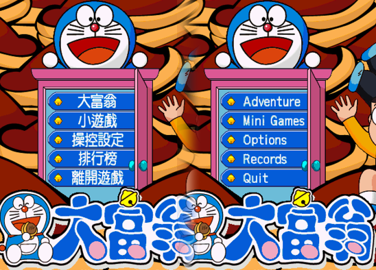
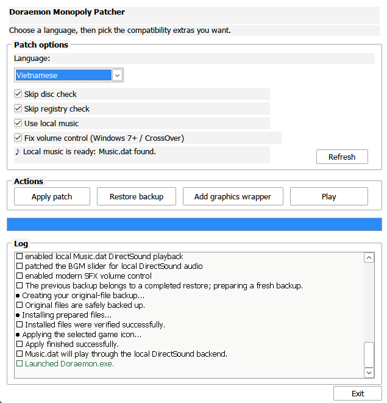
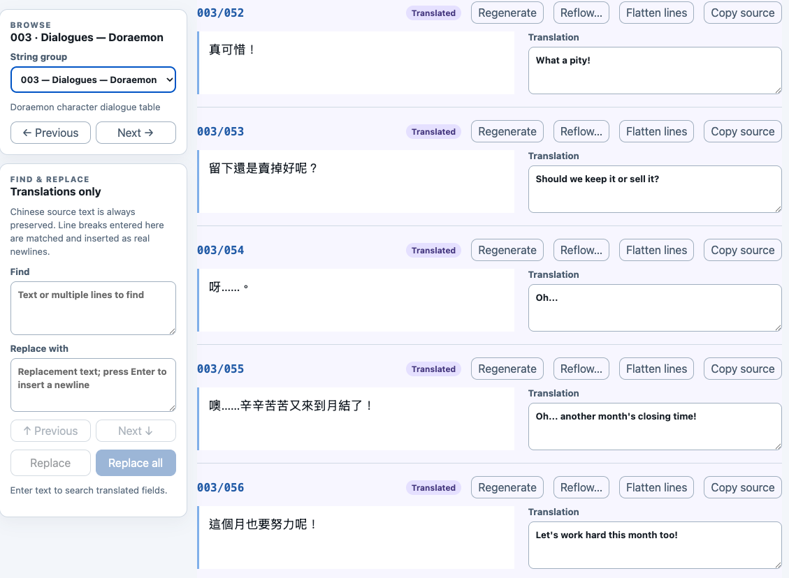
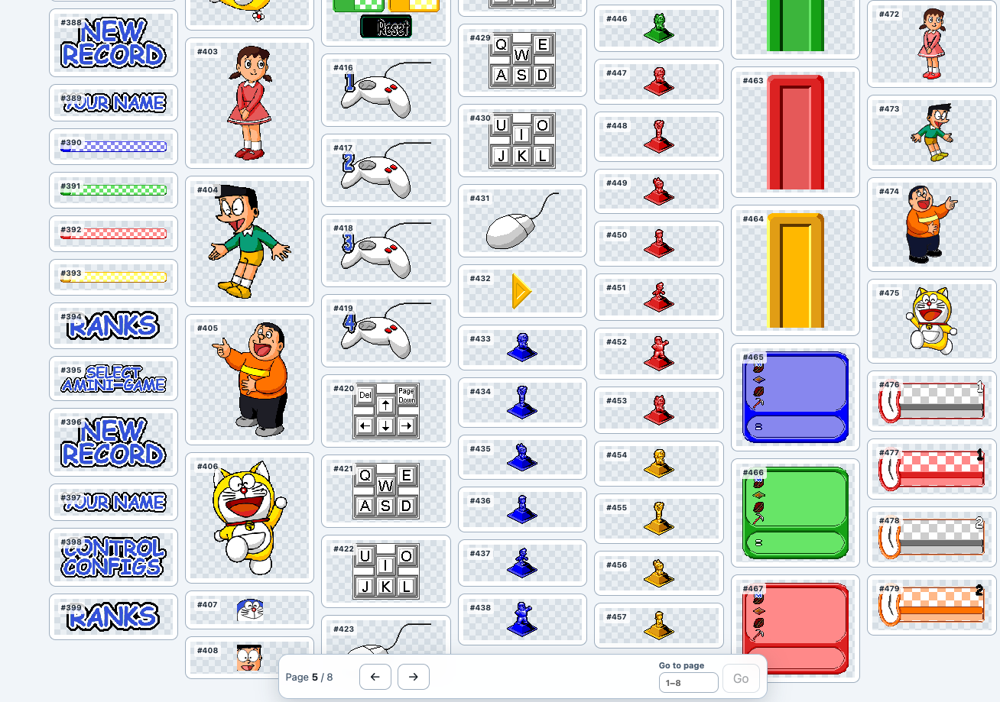
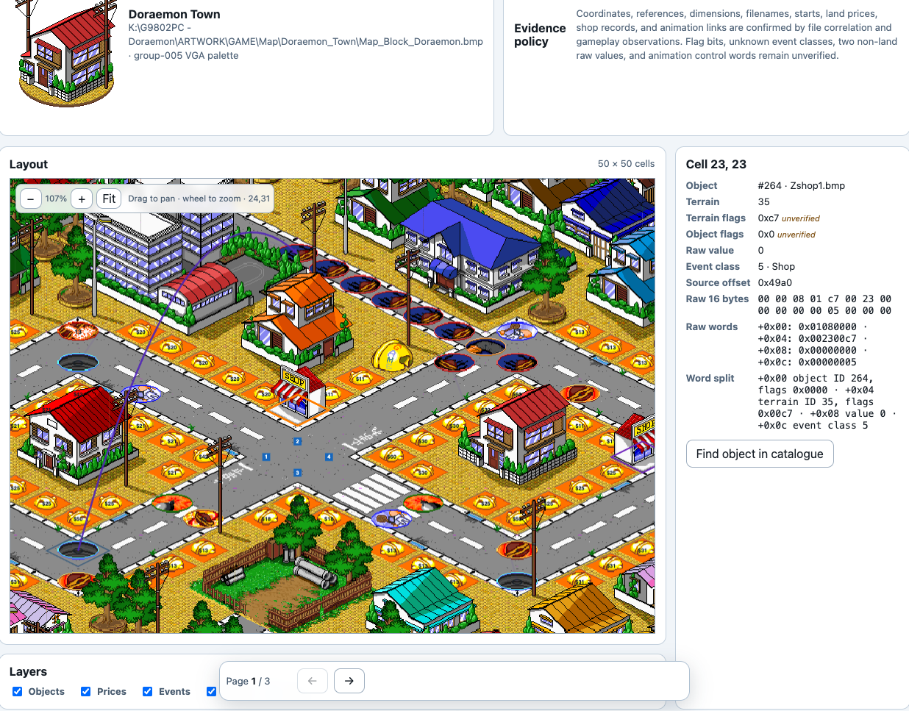
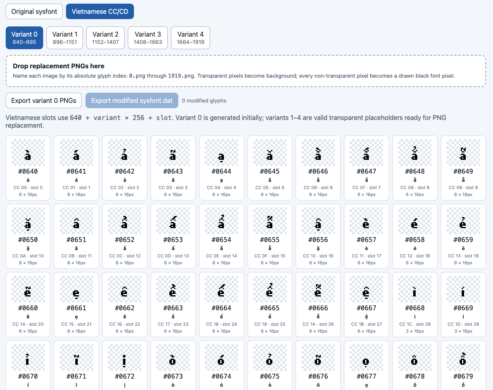

# Doraemon Monopoly localization

[](#current-state)
[](#current-state)
[](https://github.com/lhuthng/doraemon-monopoly-localization/releases)
[](#legal)

<p align="center">
  
</p>

This project localizes GameOne's 1998 Windows 95/98 game **Doraemon Monopoly**.
The game is old and tightly coupled to its resource formats, executable layout,
registry settings, and CD audio. A normal translation file is not enough, so
this repository also patches the game and provides the tools needed to build
those patches.

The repository has two parts:

1. **Resource Studio** manages and inspects translations and game resources.
   It decodes, edits, and rebuilds strings, fonts, bitmaps, sprites, and other
   archive data. It can inspect map data and includes a map layout/object
   inspector, but map editing is not currently supported.
2. **The patcher** collects reviewed resource differences and executable fixes
   into a Windows patcher. It applies those changes to a user's own game.

The original game, executables, disc images, music, and extracted artwork are
not distributed here. Only tooling, documentation, and difference payloads are
tracked. You need your own legally obtained game files.

## In pictures

The patcher applies a selected language and compatibility options from beside
the game executable:

<p align="center">
  
</p>

Resource Studio provides separate views for translation, graphics, fonts, and
map inspection:

| Dialogue editing | Sprite resources | Map inspection |
| --- | --- | --- |
|  |  |  |

## Current state

- English and Vietnamese dialogue translations are complete.
- UI text and baked-in image text are still incomplete in both languages, with
  more remaining Vietnamese artwork. Some menus and graphics therefore remain
  in the original language.
- The patcher is tested with Cantonese v1.26 and also works with v1.18.
- The patcher can apply language changes, executable fixes, registry and CD
  compatibility options, local music, backups, restore support, and an
  optional cnc-ddraw graphics wrapper.

## For players

Download a patcher from the [GitHub Releases](https://github.com/lhuthng/doraemon-monopoly-localization/releases)
page. Copy it beside your own `Doraemon.exe`, run it, choose **English** or
**Vietnamese**, and press **Apply**. The patcher validates the installation,
creates a backup, applies only the selected differences, and writes a restore
tool. **Restore** returns the tracked files to their pre-patch state.

The game expects a particular folder layout and normally checks its registry
and CD-related configuration. Keep the patcher beside the game executable and
let it handle these checks. If the original game requires the disc, the game
may still need it for music or other CD-backed data.

### Patcher options

| Option | Effect |
| --- | --- |
| Language | Applies the selected English or Vietnamese difference payload. |
| Skip disc check | Does not require the original CD check during patching. It does not provide CD content. |
| Skip registry check | Skips validation of the expected Windows registry setup. |
| Use local music | Replaces CD/MCI music playback with `Music.dat` and the bundled DirectSound helper, using a supplied WAV or CUE/BIN source. |
| Fix volume control | Patches the legacy volume path for Windows 7+ and CrossOver. |
| Add graphics wrapper | Installs the bundled cnc-ddraw files for improved compatibility with modern graphics systems. This is separate from the language patch. |
| Play | Launches the patched `Doraemon.exe` from the patcher's folder. |
| Restore backup | Restores the original files saved before the last patch operation. |

### Playing without the original CD music

The game's music is stored on the CD and accessed through the old MCI/CD audio
path. To use local music instead, provide either a matching
`DoraemonMusic.wav` or the original matching CUE/BIN files beside the game,
then enable **Use local music** in the patcher. It creates `Music.dat` and
installs the small DirectSound helper needed for playback. Without that option,
the original CD/MCI behavior is left in place.

### Compatibility notes

This is a patch for a specific 1998 game layout, not a general-purpose remake.
Keep an untouched copy of the game, use the patcher's backup and restore
controls, and expect some untranslated text in images and UI. The optional
cnc-ddraw wrapper can help older graphics behavior on modern Windows.

## For developers

### Requirements

- Rust and Cargo
- Bun
- GNU MinGW when building Windows patchers on macOS:

```sh
brew install mingw-w64
```

Place these files from your own untouched game in the ignored `tmp/base/`
directory:

```text
Doraemon.exe
strings.dat
sysfont.dat
Sprite1.dat
sprite2.dat
bitmaps.dat
```

Never commit original game files. The setup process creates ignored local
workspaces under `resource-studio/local-game/`.

### Resource Studio

```sh
make setup
cd resource-studio
bun install
bun run dev-en       # English workspace
bun run dev-vi       # Vietnamese workspace
```

The Studio includes:

- string decoding, translation, reflow, and archive rebuilding;
- font inspection and Vietnamese glyph-bank support;
- palette-aware bitmap and sprite import/export;
- Sprite1 and Sprite2 inspection and editing;
- map layout and object inspection;
- archive offset and format validation.

### Inspectors

Inspection is available throughout the Studio, not only in the map view. The
graphics workspace browses indexed bitmap and sprite records, shows their
archive IDs and dimensions, and lets contributors export or replace supported
images. The font workspace displays glyph slots and encoding bytes. The map
inspector overlays terrain, prices, events, player starts, shops, and objects
on the map, then shows the selected cell's coordinates, resource reference,
flags, event class, source offset, and raw bytes. Map fields are currently
read-only; resource and font records have the editing controls described in
the Studio documentation.

<p align="center">
  
</p>

See [`resource-studio/README.md`](resource-studio/README.md) for routes and
Studio-specific commands.

<p align="center">
  
</p>

The current map view is an inspector rather than an editor. It can correlate
map cells, objects, event classes, source offsets, and decoded resource
records, which makes it useful for reverse engineering without changing map
data.

### Build workflow

The workflow is based on differences:

```text
private original game + private edited workspace
                    -> reviewed .dmpatch difference
                    -> Windows patcher with embedded differences
                    -> user's own game installation
```

Useful commands:

| Command | Purpose |
| --- | --- |
| `make setup` | Prepare private English and Vietnamese Studio workspaces. |
| `make build-patch LANGUAGE=english` | Build an ignored candidate payload in `tmp/patches/`. |
| `make build-patch LANGUAGE=vietnamese` | Build the Vietnamese candidate payload. |
| `make build-patch LANGUAGE=english PUBLISH=1` | Write the reviewed payload to `patches/`. |
| `make build-patch LANGUAGE=english PATCHER=1` | Build a local Windows patcher in `tmp/release/`. |
| `make build-patcher` | Build one configurable patcher from tracked payloads. |
| `make help` | Show the current command summary. |

The Rust workspace contains the archive formats, semantic string patches,
binary deltas, executable patches, backup/restore logic, font extension, and
CD-audio conversion. The patch-build crate packages reviewed payloads and
builds release artifacts; the patcher crate provides the native Windows UI.

Run the project checks with:

```sh
cargo test --workspace
cd resource-studio
bun run check
bun run test
bun run lint
bun run build
```

### Documentation

- [Known file formats](docs/file-formats.md)
- [Reverse-engineering journal](docs/reverse-engineering-journal.md)
- [Sprite localization catalogue](docs/sprite-localization-catalog/README.md)
- [Executable portability research](archive/EXECUTABLE_PORTABILITY_RESEARCH.md)
- [Executable font research](archive/EXECUTABLE_FONT_RESEARCH.md)

## Legal

This repository contains original tooling, documentation, difference payloads,
and permissively licensed compatibility files. It does not contain the game or
replace the need for a legally obtained copy. Use the project only with files
you are entitled to use.

cnc-ddraw is redistributed under its included MIT license. See
[`third_party/cnc-ddraw/LICENSE`](third_party/cnc-ddraw/LICENSE) and the
[upstream project](https://github.com/FunkyFr3sh/cnc-ddraw).
